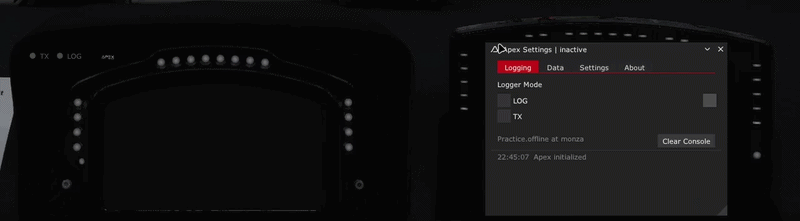

---

Apex Datalogger is an offline-first telemetry tool, capturing over 180 channels of data per lap with precise timestamping for post-session analysis while also offering built-in live telemetry streaming over UDP, running independently or alongside local logging.

<h4 align="center"><strong>
<a href="#installation">Installation</a> - <a href="#features">Features</a>
 
<a href="#usage-guide">Usage Guide</a>
</strong></h4>

<h4 align="center">for</h4>

## Installation

#### Requirements
- Content Manager
- CSP v0.2.8 or higher (always recommended to use latest stable version)

#### Installation

- Download the [latest release](https://github.com/fabetabilo/apex-logger/releases/latest/Apex.zip) and extract the ZIP file.
- Copy `apps` folder to the AC root folder `..\steamapps\common\assettocorsa` manually.

If everything went well, two apps should be accesible in the session sidebar:

> Note: In case you are having issues with the app installation, check the extended [installation guide](https://github.com/fabetabilo/apex-logger/wiki)

 
<em> Apex Hud & Apex Settings apps </em>

## Features

Apex Datalogger logs data the same way a real datalogger in motorsports would, but instead of writing to an SD card, the sim telemetry is saved lap by lap to a dedicated laps folder inside the app directory `apps/lua/apex/laps/`.

- **Fully automatic**: install once and let it run in the background, no need to keep the app window open. Keeping the HUD active is recommended just to check the logger mode status.
- **Stint-based logging**: laps are grouped and saved by stint, with automatic detection of invalid stints.
- **Local logging & UDP streaming**: capture telemetry locally, stream it live over UDP, or run both at the same time, each mode works independently.
- **LOG mode**: for saving laps locally.
- **TX mode**: for transmitting telemetry over UDP to a specific IP and port.
- **Single-logic channel selection**: choose which channel groups to log or stream. Note that the same selection drives both the local log and the UDP stream, so both modes always carry the same data.
- **Performance by design**: unselected channel groups are never read, keeping overhead low no matter how many channels are available.
- **180+ channels across 12 groups**:
    - `session` — track and weather conditions, real-time session data.
    - `car_info` — car status, fuel, electronics, temperatures, damage, driving modes, race position, sector times.
    - `tires` — tire temperatures, pressures, and surface wear.
    - `dyn` — vehicle dynamics, speed, drivetrain torque and power, wheels-off-track count.
    - `ext_elect` (extended electronics) — hybrid and prototype/open-wheel electronics (LMP1, LMH, F1), including DRS and ERS/KERS support.
    - `aero` — aerodynamic forces and drag, including per-wing aero load.
    - `sim_info` — force feedback, simulator FPS, physics rate, CPU time.
    - `input` — driver inputs: RPM, clutch, throttle, brake, TC/ABS/TC2 modes, lap times, brake torque.
    - `gps` — car position, pitch/roll/yaw rates and angles.
    - `tires_dyn` — tire dynamics: forces, slip, loads, wheel speeds.
    - `gforce` — G-forces.
    - `susp` (suspension) — full suspension geometry: ride heights, CG height, suspension travel, damper data, camber, toe, caster.
    > Note: For more channel information check the official [documentation](https://github.com/fabetabilo/docs/channels)
- **Python buffer app**: an `apex` Python app acts as a data buffer, extending telemetry acquisition.
- **Extended Control app integration**: map buttons to toggle LOG and TX modes on and off.
- **Lap exports**: laps are exported with a customizable driver name and timestamps.
- **Lap CSV export**: laps are exported in .CSV format files.
- **Built-in console**: shows live datalogger status and a running log of completed laps, including lap time, outlap flag, and invalid-lap flag.
- **Session mode support**: Hotlap, Practice, and Race are supported; other modes are untested.
- **Two in-game modules**:
    - **Apex Settings** — configure channel groups, modes, and export options.
    - **Apex HUD** — a simple, at-a-glance display of what the app is doing, with two indicators showing the current LOG and TX status.

---

 
All names, logos, external apps and brands are the property of their respective owners. Use of these names does not imply endorsement.

